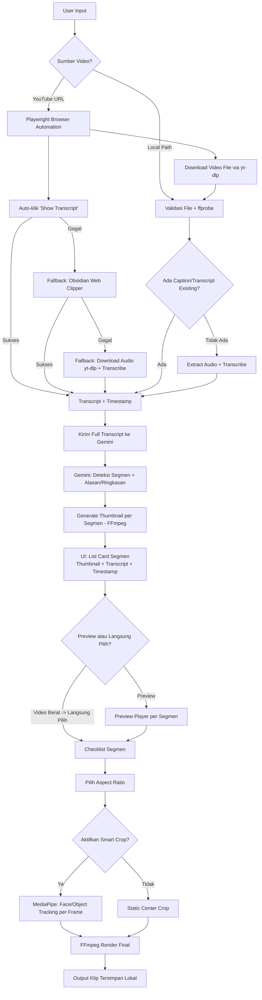
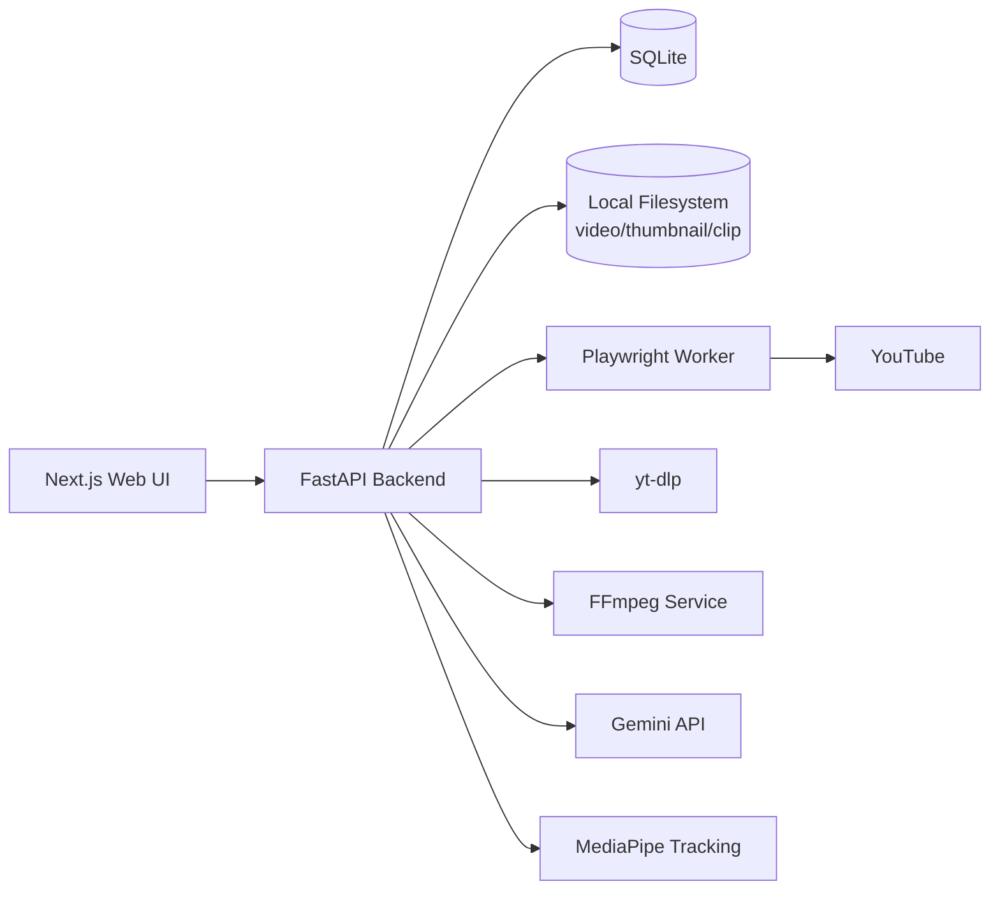

# VexoAI — Business, Product & Technical Requirements Document

| | |
|---|---|
| **Produk** | VexoAI |
| **Tipe** | Local Web App (single-user, jalan di mesin sendiri) |
| **Versi Dokumen** | 0.1 (Draft) |
| **Tanggal** | 1 September 2026 |
| **Status** | Draft — menunggu validasi keputusan di bagian "Open Questions" |

---

## Ringkasan Eksekutif

VexoAI adalah web app lokal yang mengotomasi proses **memotong video panjang menjadi klip-klip pendek siap pakai**. Sumber video bisa berupa file yang sudah didownload (path lokal) atau langsung dari URL YouTube. Sistem mengambil transcript video, mengirimkannya ke Gemini untuk mendeteksi segmen-segmen menarik lengkap dengan alasan/ringkasan tiap segmen, menampilkan thumbnail per segmen, lalu memungkinkan user memilih segmen mana yang ingin dirender jadi file video baru — dengan opsi aspect ratio dan opsi "smart crop" yang mengikuti subjek utama (face/object tracking).

---

# BAGIAN 1 — BUSINESS REQUIREMENTS DOCUMENT (BRD)

## 1.1 Latar Belakang & Masalah

Proses membuat klip pendek (untuk short-form content: Reels, Shorts, TikTok) dari video panjang saat ini dilakukan manual: menonton ulang seluruh video, mencatat timestamp menarik, memotong dengan editor, lalu crop ke rasio vertikal secara manual. Proses ini memakan waktu dan repetitif, terutama kalau volume video yang diproses banyak.

## 1.2 Tujuan Bisnis

- Memangkas waktu produksi klip pendek dari hitungan jam menjadi menit.
- Menghilangkan kebutuhan menonton ulang video secara penuh untuk mencari momen menarik.
- Menyediakan satu alur kerja (workflow) tunggal yang menangani baik video yang sudah didownload maupun video yang masih berupa link YouTube.

## 1.3 Target Pengguna

Single-user / personal tool. Pengguna utama: pemilik produk sendiri (content creator / editor yang mengelola banyak video sumber untuk dipotong jadi konten pendek).

> **Asumsi:** Karena ini local web app single-user, tidak ada kebutuhan multi-tenant, auth kompleks, atau billing. Kalau ternyata akan dipakai tim/multi-user, ini perlu direvisi di bagian scope.

## 1.4 Value Proposition

"Dari link atau file video mentah, sampai daftar klip siap render — otomatis, dengan alasan kenapa tiap klip dipilih."

## 1.5 Ruang Lingkup Bisnis

**In-scope:**
- Input video dari path lokal dan dari URL YouTube.
- Ekstraksi & penyimpanan transcript.
- Deteksi segmen menarik otomatis via AI (Gemini).
- Preview dan seleksi manual segmen.
- Render output dengan pilihan aspect ratio dan smart crop.

**Out-of-scope (untuk versi awal):**
- Platform selain YouTube (Vimeo, TikTok, dsb) — bisa jadi Fase 3+.
- Auto-publish/upload ke platform sosial media.
- Multi-user / kolaborasi / cloud hosting.
- Editing lanjutan (text overlay, musik, transisi) — VexoAI fokus di *pemotongan*, bukan full editor.

## 1.6 Asumsi & Batasan

- Aplikasi berjalan 100% lokal (localhost), tidak di-deploy ke cloud publik pada versi awal.
- Butuh API key Gemini (berbayar sesuai pemakaian) — ini jadi biaya operasional, bukan biaya development.
- Scraping YouTube (transcript & metadata) berada di area abu-abu terhadap Terms of Service YouTube. Karena tool ini personal/internal, risiko rendah, tapi tetap dicatat sebagai risiko (lihat 1.8).
- Kualitas hasil "smart crop"/object tracking bergantung pada kualitas video sumber (resolusi, pencahayaan).

## 1.7 Kriteria Sukses (Bisnis)

| Metrik | Target Awal |
|---|---|
| Waktu dari input video → daftar klip siap pilih | < 5 menit untuk video 30 menit |
| Waktu dari pilih segmen → file klip jadi | < 1 menit per klip (tergantung durasi & smart crop on/off) |
| Persentase segmen usulan AI yang dipakai user | ≥ 50% (indikator relevansi hasil Gemini) |

## 1.8 Risiko Bisnis

| Risiko | Dampak | Mitigasi |
|---|---|---|
| YouTube mengubah struktur halaman → scraping gagal | Fitur URL YouTube berhenti berfungsi | Fallback berlapis (lihat TRD 3.3), plus fallback ke yt-dlp + transcribe audio |
| Biaya API Gemini membengkak seiring volume video | Biaya operasional naik | Batasi ukuran transcript yang dikirim, cache hasil, beri estimasi biaya sebelum proses |
| Ketergantungan pada satu vendor AI (Gemini) | Kalau API down/berubah, fitur inti berhenti | Desain service layer AI agar mudah diganti provider lain di masa depan |
| Area abu-abu ToS YouTube untuk scraping | Risiko akun/IP terblokir | Gunakan rate limiting, jangan agresif, delay antar request |

---

# BAGIAN 2 — PRODUCT REQUIREMENTS DOCUMENT (PRD)

## 2.1 Ringkasan Produk

VexoAI menerima video (path lokal atau URL YouTube) → mengambil transcript → mengirim ke Gemini untuk usulan segmen klip → menampilkan tiap segmen sebagai card (thumbnail + cuplikan transcript + timestamp) → user preview/pilih → render jadi file video baru dengan FFmpeg, dengan opsi aspect ratio dan smart crop mengikuti subjek.

## 2.2 User Story Utama

1. *Sebagai user*, saya ingin memasukkan path video lokal, supaya sistem langsung memproses tanpa saya perlu upload manual.
2. *Sebagai user*, saya ingin memasukkan URL YouTube, supaya saya tidak perlu download videonya secara manual dulu.
3. *Sebagai user*, saya ingin melihat daftar segmen yang diusulkan AI lengkap dengan alasan/cuplikan transcript-nya, supaya saya bisa cepat memutuskan mana yang relevan.
4. *Sebagai user*, saya ingin bisa preview tiap segmen, tapi kalau videonya berat, saya ingin bisa langsung centang segmen mana yang mau dipotong tanpa harus preview dulu.
5. *Sebagai user*, saya ingin memilih aspect ratio output (misal 9:16 untuk Reels/Shorts).
6. *Sebagai user*, saya ingin opsi "smart crop" yang otomatis mengikuti orang/subjek utama di video saat di-crop vertikal, supaya saya tidak perlu crop manual.

## 2.3 Alur Pengguna End-to-End (User Flow)



## 2.4 Daftar Fitur

### MVP (Fase 1)

| Fitur | Deskripsi |
|---|---|
| Input path lokal | User masukkan path file video, sistem baca metadata via ffprobe |
| Ekstraksi transcript (lokal) | Kalau tidak ada caption, extract audio → transcribe |
| Segmentasi otomatis via Gemini | Kirim transcript lengkap, Gemini balikan list `{start, end, title, ringkasan, alasan}` |
| Thumbnail per segmen | FFmpeg ambil frame di titik tengah tiap segmen |
| List card segmen | UI menampilkan thumbnail + transcript cuplikan + timestamp tiap segmen |
| Checklist tanpa preview | User bisa langsung pilih segmen tanpa harus preview (untuk video berat) |
| Pilih aspect ratio | Dropdown: 16:9 / 9:16 / 1:1 / custom |
| Render static crop | FFmpeg render klip dengan crop tetap (bukan tracking) |

### Fase 2

| Fitur | Deskripsi |
|---|---|
| Input URL YouTube | Playwright otomasi ambil transcript + yt-dlp download video |
| Fallback Obsidian Web Clipper | Kalau scraping langsung gagal |
| Preview player per segmen | Player ringan untuk preview sebelum pilih |
| Smart crop / subject tracking | MediaPipe face/object tracking untuk auto-follow subjek saat crop vertikal |

### Fase 3 (Nice-to-have)

| Fitur | Deskripsi |
|---|---|
| Batch processing multi-video | Proses beberapa video sekaligus dalam antrian |
| Low-res proxy preview | Preview pakai versi resolusi rendah supaya ringan |
| Riwayat & re-export | Simpan histori job supaya bisa export ulang tanpa proses dari awal |

## 2.5 Non-Functional Requirements

- **Performa preview:** karena disebutkan preview "kalau berat" bisa dilewati, sistem harus punya jalur cepat (thumbnail-only, tanpa load video penuh) sebagai default, dan preview penuh sebagai opsional.
- **Idempotency:** kalau user re-run video yang sama, transcript & thumbnail yang sudah ada tidak perlu diproses ulang (cache berbasis hash file / video ID).
- **Observability:** setiap tahap panjang (transcribe, Gemini call, render) tampilkan progress ke user (proses ini bisa makan waktu beberapa menit).

## 2.6 Metrik Sukses Produk

- Rata-rata waktu total dari input → klip siap download.
- Rasio segmen usulan AI yang diterima vs ditolak user.
- Error rate proses YouTube ingestion (berapa persen URL yang gagal di-scrape dan harus fallback).

## 2.7 Open Questions (Product)

- Apakah butuh riwayat/project management (menyimpan banyak video yang pernah diproses), atau cukup satu video per sesi kerja?
- Berapa panjang maksimum video yang perlu didukung (30 menit? 2 jam? 4 jam+)? Ini menentukan strategi chunking transcript untuk dikirim ke Gemini (ada batas token).
- Apakah hasil klip perlu subtitle burned-in otomatis, atau cukup video polos hasil crop?

---

# BAGIAN 3 — TECHNICAL REQUIREMENTS DOCUMENT (TRD)

## 3.1 Rekomendasi Tech Stack

> Karena kamu belum menentukan stack, ini rekomendasi dengan alasannya — semua open-source/free-tier friendly untuk local app single-user.

| Layer | Rekomendasi | Alasan |
|---|---|---|
| Frontend | Next.js (React) + Tailwind CSS | Cepat untuk UI dashboard dengan card list, gampang integrasi player |
| Backend/API | Python + FastAPI | Ekosistem Python kuat untuk video/ML: ffmpeg-python, mediapipe, playwright, google-genai SDK, yt-dlp |
| Browser Automation | Playwright (Python) | Bisa load persistent context dengan extension Chromium (Obsidian Web Clipper) |
| Video Download | yt-dlp | Standar de-facto untuk download YouTube, lebih stabil dari scraping manual |
| Video Processing | FFmpeg (via ffmpeg-python / subprocess) | Standar untuk crop, trim, thumbnail, render |
| Transcript (fallback lokal) | Whisper (faster-whisper / whisper.cpp) | Kalau video tidak punya caption dan Gemini audio transcription tidak dipakai |
| AI Segmentasi | Gemini API (Google GenAI SDK) | Sudah ditentukan user; mendukung konteks panjang untuk transcript penuh |
| Object/Face Tracking | Google MediaPipe (Face Landmarker / Object Detector) | Jalan lokal, cepat, gratis, cocok untuk tracking per-frame dibanding panggil LLM per frame |
| Database lokal | SQLite | Cukup untuk single-user, tidak butuh server DB terpisah |
| Job/Queue | In-process async task (FastAPI BackgroundTasks) atau RQ+Redis kalau butuh antrian lebih tangguh | Untuk single-user, in-process cukup di awal; upgrade ke RQ kalau butuh batch processing (Fase 3) |
| Storage file | Filesystem lokal, terstruktur per project/video | Sederhana, tidak butuh object storage cloud untuk local app |

## 3.2 Arsitektur Komponen



## 3.3 Alur Data / Pipeline Teknis Detail

**Jalur A — Path Lokal**
1. User submit path file lokal.
2. Backend validasi file exists + `ffprobe` untuk ambil metadata (durasi, resolusi, fps).
3. Cek apakah ada file caption/transcript terlampir; jika tidak, extract audio (`ffmpeg -vn`) lalu transkripsi (Whisper lokal, atau kirim ke Gemini kalau ingin satu vendor saja).

**Jalur B — URL YouTube**
1. User submit URL.
2. Backend jalankan Playwright dengan *persistent context* yang sudah di-load extension Obsidian Web Clipper (unpacked extension folder).
3. **Primer:** Playwright auto-klik tombol "Show transcript" di halaman YouTube, scrape isi panel transcript langsung dari DOM (lebih cepat, tidak bergantung extension).
4. **Fallback 1:** kalau elemen transcript tidak ditemukan/berubah struktur, trigger action Obsidian Web Clipper untuk clip isi halaman.
5. **Fallback 2:** kalau dua-duanya gagal, download audio via `yt-dlp` lalu transkripsi via Whisper/Gemini.
6. Paralel: `yt-dlp` download video filenya juga, supaya masuk ke pipeline yang sama seperti Jalur A untuk proses crop/render.

**Titik Temu (setelah transcript didapat, dari jalur manapun)**
7. Transcript tersimpan di DB dengan timestamp per baris.
8. Transcript penuh dikirim ke Gemini dengan prompt terstruktur, minta output JSON: `[{start, end, title, summary, reason, transcript_snippet}]`.
9. Untuk tiap segmen hasil Gemini, `ffmpeg` ambil 1 frame (titik tengah durasi segmen) sebagai thumbnail, disimpan ke filesystem.
10. UI render list card: thumbnail + judul + snippet transcript + start-end time + tombol "Preview" dan checkbox "Pilih".
11. User bisa preview (load player cuma untuk rentang waktu itu, bukan seluruh video) atau langsung centang tanpa preview.
12. User pilih aspect ratio output.
13. Kalau smart crop diaktifkan: MediaPipe jalan per-frame pada rentang segmen terpilih → hasilkan koordinat crop (x, y) per frame → koordinat ini diberikan ke FFmpeg sebagai crop filter dinamis (misal via expression filter mengikuti path koordinat, atau generate crop keyframes).
14. Kalau smart crop tidak diaktifkan: static center-crop sesuai aspect ratio pilihan.
15. FFmpeg render output final, simpan ke folder output project, tampil di UI untuk didownload.

## 3.4 Data Model (Ringkas)

| Entity | Field Utama |
|---|---|
| `Video` | id, source_type (local/youtube), source_path_or_url, duration, resolution, status |
| `TranscriptLine` | id, video_id, start_time, end_time, text |
| `ClipCandidate` | id, video_id, start_time, end_time, title, summary, reason, thumbnail_path, selected(bool) |
| `ExportJob` | id, clip_candidate_id, aspect_ratio, smart_crop(bool), status, output_path |

## 3.5 API Endpoints (Garis Besar)

```
POST   /videos/local          -> submit path lokal
POST   /videos/youtube        -> submit URL YouTube
GET    /videos/{id}/status    -> cek progress ingestion/transcript
GET    /videos/{id}/segments  -> list ClipCandidate hasil Gemini
POST   /segments/{id}/export  -> trigger render (body: aspect_ratio, smart_crop)
GET    /jobs/{id}/status      -> progress render
GET    /clips/{id}/download   -> ambil file hasil
```

## 3.6 Pertimbangan Performa

- Preview tidak boleh me-load seluruh file video besar — pakai HTTP range request / potong segmen sementara jadi file kecil untuk preview.
- Thumbnail di-generate sekali dan di-cache (bukan on-the-fly tiap render ulang UI).
- Kalau transcript sangat panjang (video 2 jam+), perlu strategi chunking sebelum dikirim ke Gemini (batas konteks), lalu gabungkan hasil per-chunk.

## 3.7 Pertimbangan Legal/Etika

- Scraping halaman YouTube berada di area abu-abu ToS. Karena pemakaian personal/internal dan bukan untuk redistribusi masif, risiko rendah — tapi tetap gunakan rate limiting dan hindari request agresif/paralel besar-besaran.
- Konten hasil crop dari video YouTube tetap tunduk pada hak cipta pemilik video asli — VexoAI adalah *tooling* pemrosesan, bukan pembebas hak cipta.

## 3.8 Keamanan

- API key Gemini disimpan di environment variable / `.env`, tidak pernah di-commit ke repo.
- Karena local web app, tetap disarankan bind ke `localhost` saja (bukan `0.0.0.0`) supaya tidak accidentally exposed ke jaringan.

---

## 4. Roadmap Ringkas

| Fase | Fokus |
|---|---|
| **Fase 1 (MVP)** | Path lokal saja → transcript → Gemini segmentasi → thumbnail → pilih → static crop render |
| **Fase 2** | Tambah jalur YouTube (Playwright + fallback Obsidian Web Clipper), preview player, smart crop dengan MediaPipe |
| **Fase 3** | Batch processing, low-res proxy preview, riwayat project, optimisasi performa |

## 5. Open Questions (Rangkuman Semua Bagian)

1. Apakah perlu riwayat/multi-project, atau satu video per sesi kerja sudah cukup untuk versi awal?
2. Batas durasi video maksimum yang perlu didukung — ini menentukan strategi chunking transcript ke Gemini.
3. Apakah output klip perlu subtitle burned-in otomatis?
4. Untuk transcript video lokal tanpa caption: transkripsi pakai Whisper lokal (gratis, butuh compute) atau kirim ke Gemini (berbayar, lebih simpel secara arsitektur)?

